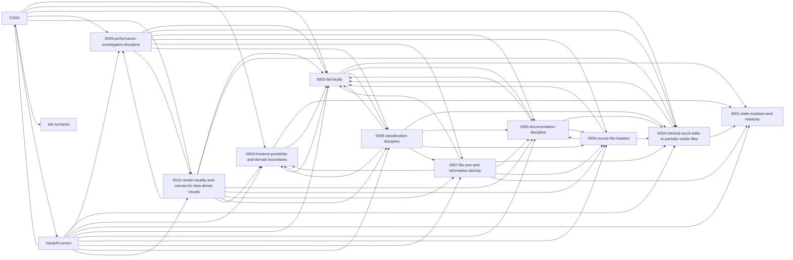

<!-- GENERATED by tools/doc-graph/generate.mjs — do not edit by hand. Run `node tools/doc-graph/generate.mjs` to regenerate. -->

# Documentation graph

A machine-generated map of the project's documentation graph — nodes are
documents, edges are the cross-references between them — with a commit-distance
staleness heatmap. Generated by `tools/doc-graph/generate.mjs` from one
git-driven prose-scan pass; the manifest `docs/doc-graph.json` is the source
of truth and the picture is a projection of it.

- **Primary artifact:** [`docs/doc-graph.svg`](./doc-graph.svg) — clickable,
  clustered-by-directory, staleness-coloured. Open it in GitHub's file view;
  each node links to its document.
- **Manifest (source of truth):** [`docs/doc-graph.json`](./doc-graph.json).
- **Broken-reference report:** [`docs/doc-graph-report.md`](./doc-graph-report.md).
- **Design note (the spec):**
  [`docs/notes/documentation-graph-artifact-plan.md`](./notes/documentation-graph-artifact-plan.md).

## At a glance

- **Nodes:** 331 documents.
- **Edges:** 1664 cross-references
  (1418 resolved, 246 dangling, 0 ambiguous).
- **Generated at HEAD:** `7f036822aaa3`
  (1001 commits deep).

## Staleness heatmap (buckets)

Each node is coloured by commit-distance since its last touch
(`git rev-list --count <last-touch>..HEAD`) — counts, not wall-clock. Buckets:
**fresh** (≤ 20), **recent** (≤ 80), **aging** (≤ 250), **stale** (> 250). Absolute age (since first commit) is also in the manifest but is
*not* the gradient — a foundational ADR should be old and untouched; that is
not rot.

### Most-stale documents (top 30 by commit-distance)

| Document | Bucket | Commits behind HEAD (last touch) | Since first commit |
|---|---|---|---|
| `backend/docs/tree-dsl.md` | stale | 999 | 999 |
| `docs/adr/0001-state-mutation-and-readonly.md` | stale | 999 | 999 |
| `docs/adr/0004-minimal-touch-edits-to-partially-visible-files.md` | stale | 999 | 999 |
| `docs/archive/34b-complete-status.md` | stale | 999 | 999 |
| `docs/archive/34b-frontend-brief.md` | stale | 999 | 999 |
| `docs/archive/34b-parallel-frontend-work.md` | stale | 999 | 999 |
| `docs/archive/handoff-2026-04-frontend-pre-umbrella.md` | stale | 999 | 999 |
| `docs/adr/0003-frontend-portability-and-domain-boundaries.md` | stale | 997 | 999 |
| `docs/playbooks/monorepo/editorial-cleanup-plan.md` | stale | 996 | 997 |
| `docs/playbooks/monorepo/monorepo-plan-framing.md` | stale | 996 | 999 |
| `docs/adr/0006-source-file-headers.md` | stale | 995 | 995 |
| `docs/notes/audit-reflections.md` | stale | 995 | 995 |
| `docs/adr/0007-file-size-and-information-density.md` | stale | 989 | 989 |
| `docs/rfcs/README.md` | stale | 977 | 977 |
| `docs/rfcs/0001-adr-meta-review.md` | stale | 962 | 977 |
| `docs/notes/doc-graph-discipline-plan.md` | stale | 952 | 952 |
| `backend/docs/redis-local-resource.md` | stale | 918 | 920 |
| `docs/playbooks/monorepo/monorepo-plan.md` | stale | 896 | 999 |
| `docs/notes/tenancy.md` | stale | 889 | 999 |
| `docs/archive/release-scope-2026-04.md` | stale | 864 | 864 |
| `docs/notes/distribution-packaging.md` | stale | 864 | 864 |
| `docs/notes/auditor-notes.md` | stale | 774 | 979 |
| `docs/dispatch/proxy-to-proxy-id-translation-near-miss.md` | stale | 739 | 739 |
| `docs/dispatch/proxy-to-proxy-post-v1.0.13-followups.md` | stale | 645 | 645 |
| `docs/archive/TODO-completed-2026-05-06.md` | stale | 644 | 644 |
| `docs/adr/0005-documentation-discipline.md` | stale | 575 | 995 |
| `docs/archive/dispatch/backend-to-frontend-analysis-persistence-status.md` | stale | 552 | 552 |
| `docs/archive/dispatch/backend-to-frontend-auth-me-status.md` | stale | 552 | 552 |
| `docs/archive/dispatch/backend-to-frontend-card-tree-status.md` | stale | 552 | 552 |
| `docs/archive/dispatch/backend-to-frontend-game-source-dedup-status.md` | stale | 552 | 552 |

## Pruned graph (inline)

The full graph hairballs at this scale (and so would a first-order expansion
around the hubs, which cite most of the tree). The inline Mermaid view below is
**pruned to the core set** — the ten ADRs plus the three hub documents
(`adr-synopsis`, `handoff-current`, `TODO`), with edges drawn only among
that set: the ADR lattice and how each hub connects to it. The complete,
clickable graph is [`docs/doc-graph.svg`](./doc-graph.svg).



## Broken-reference report

**67** dangling references from **live** documents (genuine-action candidates), 179 from frozen archive (expected drift), and 0 ambiguous, after the ADR-0005 Rule 4 code-block/placeholder filter. See [`docs/doc-graph-report.md`](./doc-graph-report.md) for the full list, split by origin — the maintainer reviews it; nothing is auto-fixed.

## Regeneration

This artifact is committed and CI-verified-fresh: a workflow regenerates it on
every doc-touching PR and fails iff the committed manifest's **graph structure**
(node set, edges, resolution) drifts from a fresh run — a committed-but-stale
doc-graph would be self-refuting. The check is scoped to graph structure, not
the raw bytes, because the heatmap fields (commit-distance, bucket) are
HEAD-relative and shift uniformly as the repo moves: a doc untouched for one
more commit is legitimately one commit staler. So the committed heatmap is a
snapshot at its last regeneration and refreshes whenever a doc-touching change
regenerates the artifact. To regenerate locally:

```
node tools/doc-graph/generate.mjs
```

The generator requires `dot` (Graphviz) on PATH for the SVG; it fails loudly
if absent (ADR-0002).

## License

Public Domain (The Unlicense).
