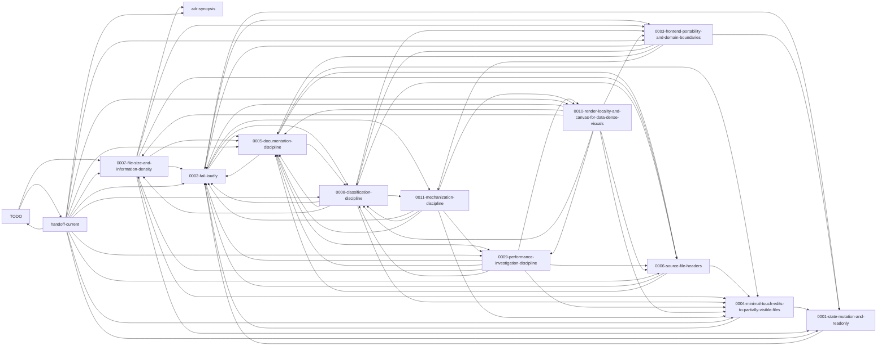

<!-- GENERATED by tools/doc-graph/generate.mjs — do not edit by hand. Run `node tools/doc-graph/generate.mjs` to regenerate. -->

# Documentation graph

A machine-generated map of the project's documentation graph — nodes are
documents, edges are the cross-references between them — with a commit-distance
staleness heatmap. Generated by `tools/doc-graph/generate.mjs` from one
git-driven prose-scan pass; the manifest `docs/doc-graph.json` is the source
of truth and the picture is a projection of it.

- **Manifest (committed source of truth):** [`docs/doc-graph.json`](./doc-graph.json).
- **The picture (`docs/doc-graph.svg`):** rendered locally, **not committed** —
  run `node tools/doc-graph/generate.mjs` (needs Graphviz `dot`) and open the
  result locally. `.gitignore`d because committing a full-relayout SVG distorted
  PR stats (GitHub counts it regardless of `.gitattributes`); an honest off-tree
  render is the planned fix.
- **Broken-reference report:** [`docs/doc-graph-report.md`](./doc-graph-report.md).
- **Design note (the spec):**
  [`docs/archive/notes/design/documentation-graph-artifact-plan.md`](./archive/notes/design/documentation-graph-artifact-plan.md).

## At a glance

- **Nodes:** 456 documents.
- **Edges:** 2181 cross-references
  (1807 resolved, 374 dangling, 0 ambiguous).

## Staleness heatmap (buckets)

Each node is coloured by commit-distance since its last touch
(`git rev-list --count <last-touch>..HEAD`) — counts, not wall-clock. Buckets:
**fresh** (≤ 20), **recent** (≤ 80), **aging** (≤ 250), **stale** (> 250). The first-commit date (`first_committed`) is recorded per node
too, but absolute age is deliberately *not* the gradient — a foundational ADR
should be old and untouched; that is not rot. (The raw commit-distances are
computed but not committed; the bucket and the dates are the stable record —
see the Regeneration note.)

### Most-stale documents (top 30 by commit-distance)

| Document | Bucket | Last touched |
|---|---|---|
| `backend/docs/tree-dsl.md` | stale | 2026-04-26 |
| `docs/archive/34b-complete-status.md` | stale | 2026-04-26 |
| `docs/archive/34b-frontend-brief.md` | stale | 2026-04-26 |
| `docs/archive/34b-parallel-frontend-work.md` | stale | 2026-04-26 |
| `docs/archive/handoff-2026-04-frontend-pre-umbrella.md` | stale | 2026-04-26 |
| `docs/playbooks/monorepo/monorepo-plan-framing.md` | stale | 2026-04-26 |
| `docs/notes/audit-reflections.md` | stale | 2026-04-26 |
| `docs/rfcs/README.md` | stale | 2026-04-27 |
| `docs/rfcs/0001-adr-meta-review.md` | stale | 2026-04-27 |
| `backend/docs/redis-local-resource.md` | stale | 2026-04-28 |
| `docs/notes/tenancy.md` | stale | 2026-04-29 |
| `docs/archive/release-scope-2026-04.md` | stale | 2026-04-30 |
| `docs/dispatch/proxy-to-proxy-id-translation-near-miss.md` | stale | 2026-05-03 |
| `docs/dispatch/proxy-to-proxy-post-v1.0.13-followups.md` | stale | 2026-05-06 |
| `docs/archive/TODO-completed-2026-05-06.md` | stale | 2026-05-06 |
| `docs/archive/dispatch/backend-to-frontend-analysis-persistence-status.md` | stale | 2026-05-08 |
| `docs/archive/dispatch/backend-to-frontend-auth-me-status.md` | stale | 2026-05-08 |
| `docs/archive/dispatch/backend-to-frontend-card-tree-status.md` | stale | 2026-05-08 |
| `docs/archive/dispatch/backend-to-frontend-game-source-dedup-status.md` | stale | 2026-05-08 |
| `docs/archive/dispatch/backend-to-frontend-openapi-title-debrand.md` | stale | 2026-05-08 |
| `docs/archive/dispatch/backend-to-frontend-qeubo-status.md` | stale | 2026-05-08 |
| `docs/archive/dispatch/frontend-to-audit-formalize-planned-work-logging.md` | stale | 2026-05-08 |
| `docs/archive/dispatch/frontend-to-backend-analysis-persistence-status.md` | stale | 2026-05-08 |
| `docs/archive/dispatch/frontend-to-backend-analysis-persistence.md` | stale | 2026-05-08 |
| `docs/archive/dispatch/frontend-to-backend-auth-me.md` | stale | 2026-05-08 |
| `docs/archive/dispatch/frontend-to-backend-card-tree-status.md` | stale | 2026-05-08 |
| `docs/archive/dispatch/frontend-to-backend-game-source-dedup-status.md` | stale | 2026-05-08 |
| `docs/archive/dispatch/frontend-to-backend-game-source-dedup.md` | stale | 2026-05-08 |
| `docs/archive/dispatch/frontend-to-backend-qeubo-integration.md` | stale | 2026-05-08 |
| `docs/archive/dispatch/frontend-to-frontend-auth-ux-and-dirty-board-handoff.md` | stale | 2026-05-08 |

## Pruned graph (inline)

The full graph hairballs at this scale (and so would a first-order expansion
around the hubs, which cite most of the tree). The inline Mermaid view below is
**pruned to the core set** — the ten ADRs plus the three hub documents
(`adr-synopsis`, `handoff-current`, `TODO`), with edges drawn only among
that set: the ADR lattice and how each hub connects to it. The complete graph is
the locally-rendered `docs/doc-graph.svg` (not committed — run the generator).



## Broken-reference report

**40** dangling references from **live** documents in the genuine-rot classes (missing-on-disk + retired-target; 48 live total — the remainder point at on-disk files outside the node set), 326 from frozen / executed documents (expected drift), and 0 ambiguous, after the ADR-0005 Rule 4 code-block/placeholder filter. See [`docs/doc-graph-report.md`](./doc-graph-report.md) for the full list, split by origin bucket and target class — the maintainer reviews it; nothing is auto-fixed.

## Regeneration

This artifact is committed and CI-verified-fresh: a workflow checks that the
committed manifest's **graph structure** (node set, edges, resolution) matches a
fresh run, and fails iff it drifts — a committed-but-stale doc-graph would be
self-refuting. The check is scoped to graph structure, not the raw bytes: the
committed manifest stores only **stable** heatmap fields (the discrete
`age_bucket` and the absolute first/last-commit dates), never the raw
HEAD-relative commit-distances, so it changes only when a doc is added, removed,
re-genred, re-cross-referenced, *or actually touched* (its date/bucket move) —
not on every commit. A **structural** change must be regenerated in the same PR
or the gate fails; a **content-only** edit need not (the gate guards structure,
and the heatmap is an explicit snapshot — regenerating refreshes the touched
doc's freshness, a small bounded diff, but skipping it only leaves that one node
a bucket stale until the next structural regeneration). To regenerate locally:

```
node tools/doc-graph/generate.mjs
```

The generator requires `dot` (Graphviz) on PATH for the SVG; it fails loudly
if absent (ADR-0002).

## License

Public Domain (The Unlicense).
