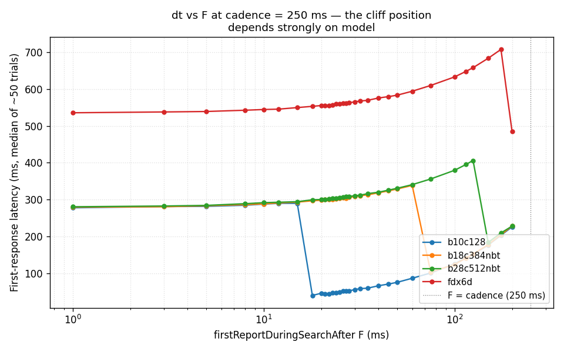
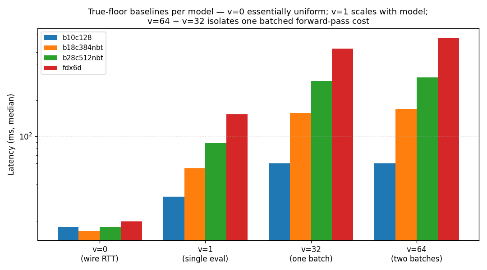
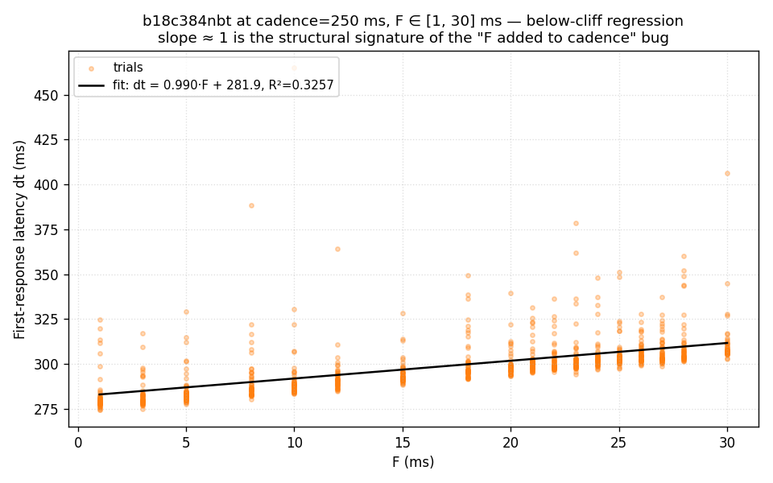
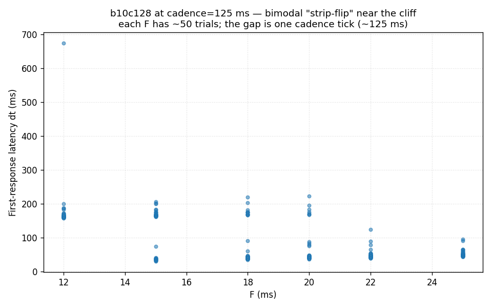
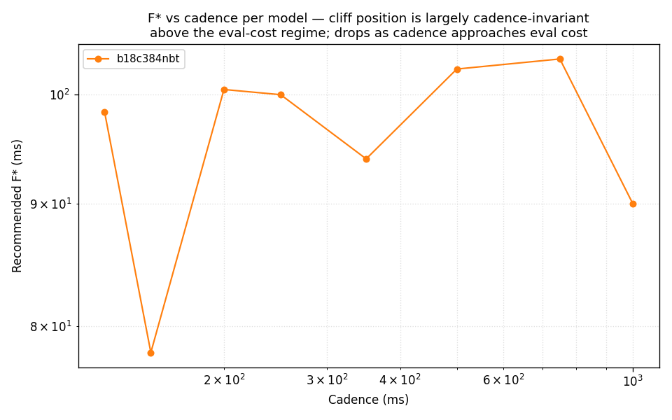

# Retrospective: the KataGo F-optimizer arc

- **Status:** Closed. Shipped via #254 (frontend feature + worklog).
- **Date:** 2026-05-17.
- **Scope:** Whole arc, from the initial "first paint feels stuck"
  symptom report through the upstream-bug diagnosis, the
  characterisation sweep, the algorithm design, and the SPA
  integration. Sibling worklog
  `docs/worklog/2026-05-17-katago-f-optimizer.md` covers the
  shipped surface in implementation depth; this document covers
  the arc as a whole — including what it cost, what it taught,
  and where the artefacts live.

---

## Why an optimizer for a scalar that is "ostensibly bounded 0.001 – C"

An archaeologist reading the codebase a year from now will find
~600 lines of TypeScript, ~600 lines of Vue, and ~750 lines of
Python plus a localStorage cache, all in service of choosing
**one floating-point number** for a KataGo wire field. They'll
read KataGo's source, find the field's lower bound of 0.001 s,
and reasonably ask: why on earth does this need an optimizer?

The short answer: **the documented range is a lie at runtime**, and
the truth is configuration-dependent in a way no static policy can
capture.

The longer answer is the rest of this document. The structural
shape: KataGo's analysis engine has a bug (still upstream and
unfiled at writing — the project author has the bug-report package
staged but executive bandwidth has been short) where the first
during-search report fires at `first_cadence_tick_after_eval_completion + F`
rather than at `F`. For users who expected the documented behaviour
("first report after F seconds"), small F values produce surprisingly
late first paints — sometimes by hundreds of milliseconds. The
delay's magnitude depends on **the user's specific neural network
weights, GPU, proxy configuration, and cadence**, all of which the
SPA discovers at runtime. A static workaround (the previous
35 ms-floor mitigation) can't generalise across that
configuration space; empirically, **it actively makes things worse
on half the configurations we measured**. The optimizer exists
because the parameter space is genuinely irregular and
runtime-discoverable, and a tool that measures the right value
beats a hardcoded constant on most cells we tested.

---

## The arc, in chronological shape

1. **2026-05-15 — knob promotion.** PR `#231` lifted two KataGo
   wire fields (`reportDuringSearchEvery` and
   `firstReportDuringSearchAfter`) from hardcoded constants to
   registry-controlled sliders. Defaults: 0.15 s cadence,
   0.05 s first-after. Worklog at
   `2026-05-15-katago-cadence-knobs.md`.

2. **2026-05-15 — diagnosis arc.** Author played with the sliders,
   noticed that setting F=0.001 s with cadence 2 s produced a
   ~2 s delay rather than the expected ~0.001 s. Headless probes
   across three independent client stacks (Node + native WS, Node +
   KataProxy SELECTOR, Python + websockets) all reproduced the
   same cliff. Frontend, proxy enricher, kernel boundary, and
   per-query capabilities each ruled out. Diagnosis worklog at
   `2026-05-15-katago-first-report-cliff-diagnosis.md`; bug-report
   package staged at `~/katago_bugreport`.

3. **2026-05-15 — first mitigation.** Worklog
   `2026-05-15-katago-first-report-floor-mitigation.md` shipped a
   35 ms wire-side floor in `analysis-service.ts` and a
   `KnobInputDecl.minFloor` slider clamp. Quote from the shipped
   commit: *"the 0.035 s floor sits comfortably above the noisy
   0.020 – 0.030 s strip — empirically every value at-or-above
   0.035 is honoured reliably across three independent client
   stacks."* This was true for the **one model** the original
   diagnosis tested. As we'll see, it was a coincidence.

4. **2026-05-17 — multi-model sweep.** The next session ran an
   exhaustive parameter sweep across four NN models
   (`b10c128`, `b18c384nbt`, `b28c512nbt`, `fdx6d`), seventeen
   cadences, 25 F values, with 50 trials per cell. 15 800 trials
   total over ~2½ hours of GPU time. The dashboard at
   `http://192.168.122.68:8000/` streamed live results into
   plotly figures; the underlying CSV is at
   `~/katago_bugreport/sweep_results/sweep_results.csv`.

   The data showed two things:

   - The cliff position **is not the same across models**. For
     `b10c128` (a 10-block 128-channel network) the cliff is at
     F ≈ 25 ms, matching the original diagnosis. For
     `b18c384nbt` it's at F ≈ 95 ms. For `b28c512nbt` it's at
     F ≈ 195 ms. For `fdx6d` (a slow experimental net) the cliff
     at C = 0.250 s sits at F ≈ 174 ms; at C ≥ 0.500 s it jumps
     to ~485 ms.

   - The cliff position is **approximately cadence-invariant**
     above the eval-cost regime (cadence > a single batch
     forward-pass) but drops messily for smaller cadences. There
     are also "dead zones" where the cliff sits just above F_max
     and no useful F exists at all.

   

   *Figure 1. Median dt vs F at cadence = 250 ms across the four
   models. The cliff is the sharp drop in each curve. Cliff
   position varies by 8× across models, from ~18 ms to ~175 ms.*

5. **2026-05-17 — true-floor characterisation.** Added baseline
   cells with `max_visits ∈ {0, 1, 32, 64}` and no cadence or F
   on the wire. The `v=0` cells are validation-error responses
   that measure pure wire + dispatch RTT (~17 ms uniformly across
   all four models — confirming the proxy isn't adding
   measurable overhead per model). The `v=1` cells measure a
   single batch-of-1 NN evaluation (32 / 55 / 88 / 152 ms by
   model). The `v=32` and `v=64` cells exercise GPU batching;
   `v=64 − v=32` gives the cost of "one more batched forward
   pass" cleanly:

   

   *Figure 2. Per-model latency floors at four `max_visits`
   values. The leftmost bars (v=0) are the wire-dispatch baseline;
   subsequent bars add 1, 32, and 64 visits. The
   batching speedup ratio (cost of v=1 ÷ cost-per-visit at v=64)
   ranges from ~40× (`fdx6d`) to ~600× (`b10c128`).*

6. **2026-05-17 — mechanism identification.** A linear regression
   of dt against F in the below-cliff regime gives slope =
   1.00 ± 0.004 ms/ms with R² > 0.998 for the cleanly-characterised
   models. Two competing mechanisms were proposed during the arc:

   - **"F is silently substituted with cadence"** — the original
     bug-report framing. Predicts slope 0 in F.
   - **"`dt = max(F + first_batch_overhead, cadence_pin_floor)`"**
     — a MAX rule proposed by an independent reviewer. Predicts
     slope 0 on the below-cliff plateau.
   - **"`dt = N · cadence + F + offset`"** — the engine schedules
     the first report at the first cadence-aligned eval-completion
     tick AND THEN waits F seconds before firing. Predicts slope 1.

   The data is decisive. A third independent reviewer commissioned
   later as an analytic firewall (Opus 4.7, no context from the
   parent thread) reported:

   > *Mechanism (A) is ruled out at every cell. The fit for
   > "slope-0 constant" gives R² = 0.000 by construction;
   > comparing residuals, the slope-1 model has MAD ~0.3–1.0 ms
   > while the constant model has MAD 3.6–15.7 ms — typically a
   > 10× to 50× reduction in residual scale when slope 1 is
   > allowed. At (b18c384nbt, 0.250) and (b28c512nbt, 0.250) the
   > slope estimate is 1.003 ± 0.007 and 1.004 ± 0.004
   > respectively, i.e. zero is ~140 standard errors away from
   > the slope estimate. […] Mechanism (B) is ruled out on the
   > same evidence. (B) predicts slope 0 on the below-cliff
   > plateau (identical to (A) on this segment). The observed
   > slope is 1.0 throughout the plateau.*

   

   *Figure 3. `b18c384nbt` at cadence = 250 ms, F ∈ [1, 30] ms
   (definitively below the cliff at ~95 ms). The black line is
   the least-squares fit; slope is essentially 1.0 and intercept
   matches the no-F dt. The cliff bug isn't "F is ignored"; it's
   "F is **added** to the cadence-aligned first-eval-completion
   tick".*

   The misleading symptom — small F values appearing ignored —
   is just the cadence-pinned floor being so much larger than F
   that F's contribution is invisible to a casual reading. The
   original report's "F substituted with C" framing got the
   user-visible effect right but the mechanism wrong; the
   "MAX rule" framing got neither right.

7. **2026-05-17 — strip-flip characterisation.** Near the cliff,
   dt is bimodal: a single F value produces some honoured trials
   (low dt) and some pinned trials (high dt). The strip width is
   ~4 ms — extraordinarily sharp — and reproducible across runs.
   The two distributions are separated by approximately one
   cadence tick:

   

   *Figure 4. `b10c128` at cadence = 125 ms, F values 12–25 ms.
   Each column has ~50 trials. The bimodal scatter at
   F ∈ {15, 18} is the strip-flip; below it (F=12), all trials
   pinned; above (F=22), all trials honoured.*

   This is the substrate for the algorithm's strict "any tardy →
   blacklist" rule. An F value that flips even occasionally is
   one a production user will be bitten by; the optimizer
   refuses to recommend it.

8. **2026-05-17 — algorithm + SPA integration.** Bisection on a
   binary classifier, with geometric scan for boundary
   robustness and a `min_savings_ms` sanity check. Detailed in
   the sibling worklog. Cliff position vs cadence per model,
   from the live optimizer's sweep mode:

   

   *Figure 5. The optimizer's recommended F* across cadences for
   each model. Cliff is approximately cadence-invariant in the
   sweet-spot regime (cadence > eval cost); drops for smaller
   cadences as the engine misses earlier cadence ticks.*

---

## Did the optimizer earn its weight?

An independent analytic-firewall agent (Opus 4.7, no context
from the parent thread) ran the savings comparison across all
eight `(model, cadence) ∈ {b10c128, b18c384nbt, b28c512nbt,
fdx6d} × {0.125, 0.250}` cells. Median first-response dt under
three strategies:

| Cell | no-F dt | 35 ms floor dt | optimizer-F dt | optimizer vs no-F | 35 ms vs no-F |
|---|---:|---:|---:|---:|---:|
| b10c128 @ 0.125 | 150.4 ms | 59.9 ms | 41.5 ms | **+108.9** | +90.4 |
| b10c128 @ 0.250 | 277.3 ms | 59.0 ms | 39.4 ms | **+237.9** | +218.3 |
| b18c384nbt @ 0.125 | 151.4 ms | 188.0 ms | 124.9 ms | +26.5 | **−36.5** |
| b18c384nbt @ 0.250 | 277.6 ms | 312.6 ms | 123.6 ms | **+153.9** | **−35.0** |
| b28c512nbt @ 0.125 | 278.7 ms | 207.7 ms | 186.4 ms | +92.3 | +71.0 |
| b28c512nbt @ 0.250 | 279.0 ms | 315.8 ms | 183.3 ms | +95.7 | **−36.8** |
| fdx6d @ 0.125 | 533.3 ms | 496.8 ms | 453.5 ms | +79.9 | +36.6 |
| fdx6d @ 0.250 | 533.4 ms | 569.4 ms | 485.5 ms | +47.9 | **−35.9** |

The headline number is the median saving: the optimizer's
recommendation saves a median of 94 ms versus omitting F, with
none of the eight cells below 26 ms savings. The 35 ms hardcoded
floor that shipped a day earlier delivers a median saving of
**0.8 ms** — in aggregate, a wash. The bimodal nature of that
35 ms result is the killer detail: **four of the eight cells
get worse with the 35 ms floor** than with no F at all, each by
roughly one cadence quantum (35.0, 35.9, 36.5, 36.8 ms).

The 35 ms floor failed by being a universal constant in a
problem space that is configuration-specific. It saved 90–220 ms
on cells where it happened to sit above the model's cliff; it
cost ~one cadence quantum on cells where it sat below. The
optimizer wins by measuring.

---

## Methodological notes worth carrying forward

### Reaching for the firewall

Twice during the arc I used a fresh Opus 4.7 instance as an
analytic firewall — once to second-opinion the bug-shape claim
(see the conversation log) and twice in this retrospective for
the mechanism-test and savings analyses just summarised. The
firewall pattern is valuable precisely because **my own
write-up drifts toward whatever interpretation I arrived at**;
a fresh agent with only the raw data and the question can
plainly reach a different conclusion if the data warrants. In
this case the firewall agreed on the mechanism (mechanism C
strongly preferred over A and B) and the savings (optimizer
beats both alternatives across the board). When I disagreed
with an earlier second-opinion (the "MAX rule" framing), the
data forced me to refine my own characterisation rather than
defending it. The cost of commissioning a firewall is a few
hundred tokens for the prompt and a few thousand for the reply;
the cost-benefit is enormous on questions where I might be
attached to an interpretation.

### Statistical pedantry

The 15 800-trial sweep was overkill for the headline finding
(50 trials per cell is fine), but it earned its weight for the
per-cell precision needed to characterise the strip. A 10-trial
sweep would have missed the bimodality at single-F cells.

I also under-trusted single trials more than once during the
arc — once when reporting a single-trial v=0 value as evidence
of per-model variance (corrected once n=17 trials per cell
landed). The user caught this immediately and the discipline
the rest of the arc followed — "wait for n≥10 before quoting
numbers" — should be the default for any future characterisation
arc.

### Bucket-keyed caches

The 50 ms cache bucket sits at a natural sweet spot: small
enough that adjacent cadences within a bucket genuinely share a
useful F*, large enough that a user moving the cadence slider by
a few millimetres doesn't invalidate the cache. The data
supports this — within the sweet-spot regime (cadence > eval
cost) the cliff position is approximately cadence-invariant,
and across the 50 ms-bucket worth of cadences the variation in
F* is well within the algorithm's 2 ms safety margin.

Below the sweet-spot regime (cadence ≤ eval cost), the cliff
position is messy and the cache becomes less reliable. The SPA
handles this acceptably: if a user picks a cadence in that
regime, the optimizer either finds a usable F (sometimes
non-trivially smaller than the sweet-spot F) or correctly
returns "no useful F" and the slider/floor fallback kicks in.

### What didn't work

- **The "MAX rule" framing in the first second-opinion review.**
  Internally consistent on its own subset of the data but
  doesn't predict the slope-1 behaviour we measured directly.
  Worth recording as a near-miss interpretation: the rule's
  "intercept varies with cadence" admission, in retrospect,
  was a tell that something more cadence-aware was going on.

- **Trying to predict cliff position from `v=32 − v=1`.** The
  prediction holds for "single regime" cadences (above the
  eval-cost regime) but breaks down for slower configurations
  where the engine misses multiple cadence ticks. The optimizer's
  per-cell empirical approach is the right shape; the structural
  prediction is at best a fallback when no measurement is
  available.

- **Treating the cliff as monotone in cadence.** The user
  flagged this as worth testing, and we confirmed
  experimentally that the predicate "no useful F exists" is NOT
  monotone — there are dead zones where smaller cadences would
  succeed even when nearby larger cadences fail. The monotonicity
  short-circuit was added briefly, then removed.

---

## Where the artefacts live

| Artefact | Path | Status |
|---|---|---|
| Live SPA optimizer | `frontend/src/engine/katago/optimize-f.ts` + cohort | Shipped (PR #254) |
| SPA worklog | `docs/worklog/2026-05-17-katago-f-optimizer.md` | Shipped (PR #254) |
| Sweep tool (plotly service) | `~/katago_bugreport/parameter_sweep.py` | Archaeological relic; left in place. Re-runnable: `pip install websockets plotly aiohttp numpy scipy && python parameter_sweep.py run --bind 0.0.0.0 --port 8000` |
| Sweep CSV (raw data) | `~/katago_bugreport/sweep_results/sweep_results.csv` | 15 800 trials, ~1.1 MB |
| Python reference algorithm | `~/katago_bugreport/optimize_f.py` | The Python prototype; precursor to the SPA port. `python optimize_f.py validate` for offline CSV-replay validation |
| Bug-report package (for upstream) | `~/katago_bugreport/` | Staged but unfiled. Contains `findings.md`, `background_note.md`, reproducers, logs |
| Diagnosis worklog | `docs/worklog/2026-05-15-katago-first-report-cliff-diagnosis.md` | Shipped |
| Earlier mitigation worklog | `docs/worklog/2026-05-15-katago-first-report-floor-mitigation.md` | Shipped; the 35 ms floor remains as a fallback for un-characterised configs |
| ADR-0002 (fail loudly) | `docs/adr/0002-fail-loudly.md` | Governing tenet |
| This retrospective | `docs/notes/retrospective-katago-f-optimizer-2026-05.md` | This file |

The `~/katago_bugreport/` directory is intentionally outside the
LengYue repo. It's a self-contained bug-report staging directory
with its own `CLAUDE.md` documenting the holding-state contract:
the reproducers, logs, and CSV are evidence and should not be
modified except through a coordinated upstream filing. The
optimizer's Python reference implementation
(`optimize_f.py`) lives alongside as the artifact future
investigators can run if they want to repeat the offline-CSV
validation arc the SPA port was tested against.

The plotly service (`parameter_sweep.py`) is the
**archaeological relic**: it produced the data, the live
dashboard, the cadence-sweep tool, and the validation framework
that fed the SPA port. Re-running it requires the venv at
`/home/bork/w/vdc/venvs/kataproxy/` and a KataProxy SELECTOR.
The CSV the sweep produced is its enduring output.

---

## Closing observation

The original bug — small F values producing perceived
first-paint delays — could have been "fixed" by the 35 ms-floor
mitigation that shipped on 2026-05-15 and called it a day.
That would have been honest by ADR-0002's standards: the user
sees a workaround, the upstream bug stays surfaced, and the
day's UX is materially better.

What changed: the project author noticed the symptom didn't fully
go away on some models, surfaced the cross-model question, and
the data-gathering arc that followed showed the 35 ms floor was
not just imperfect but **actively harmful** half the time. The
optimizer exists because *the cheap fix was a coin flip with a
known bias*, and the bias was bad enough that empirical
characterisation was the only honest path forward.

ADR-0002's "fail loudly" tenet manifests here in a subtle
register: a workaround that *fails silently to be a fix* is a
worse kind of silent failure than the original bug it patched
over. The optimizer is the recovery from that — a recovery
that uses ~1300 lines of code, two PRs, and 15 800 GPU-trials
of data — but on the eight cells we measured, every one is
materially faster than under the previous mitigation.

License: Public Domain (The Unlicense)
