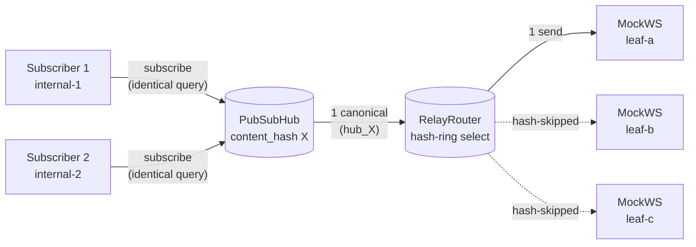
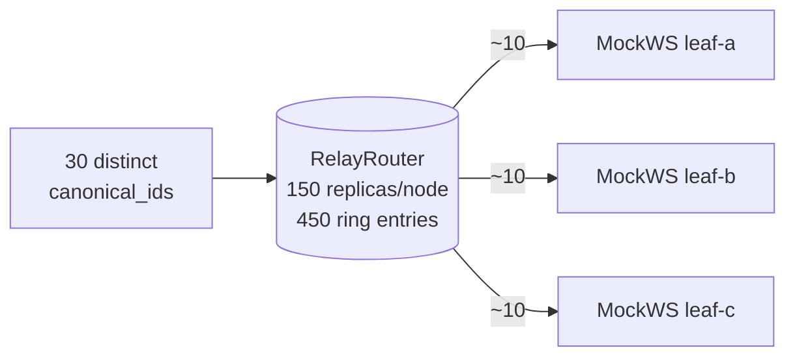
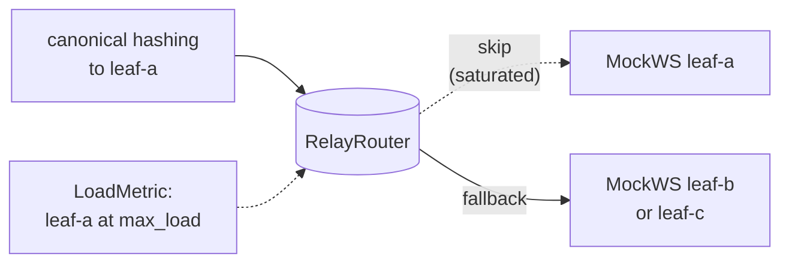
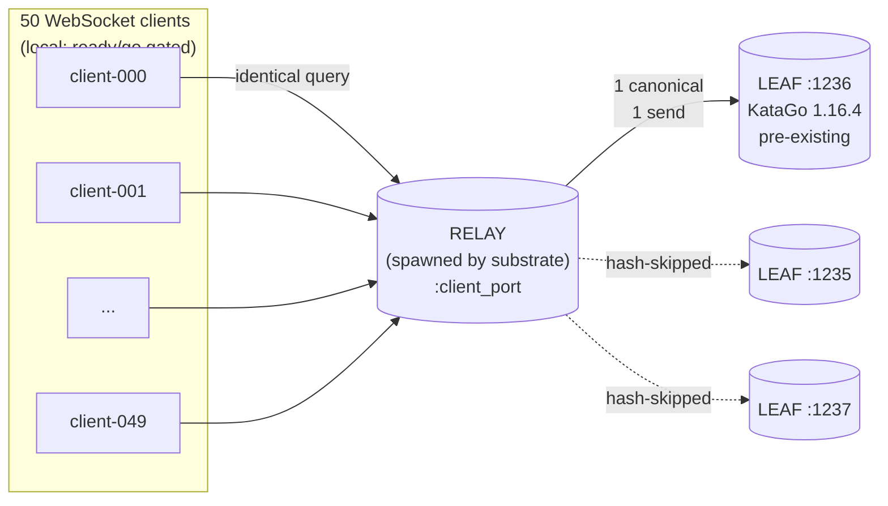
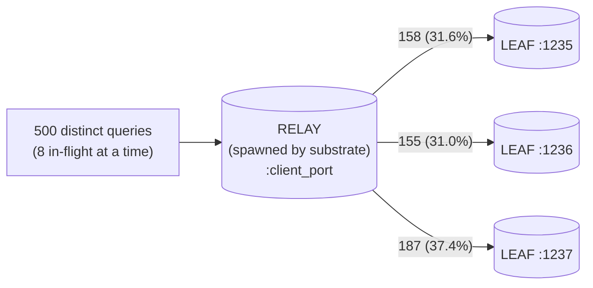
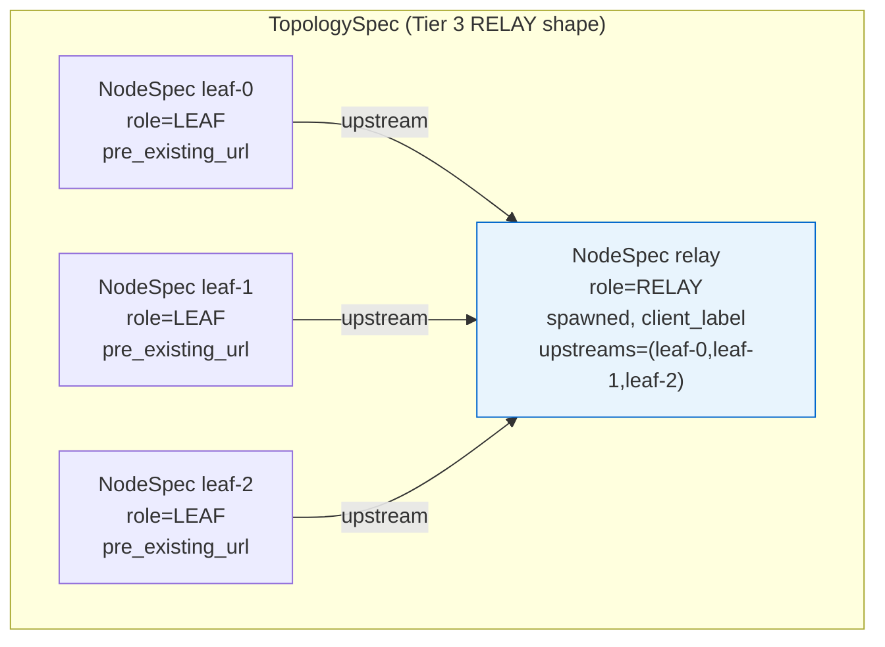

# Proxy topology testing — substrate + RELAY Tier 2/3 coverage

- **Status:** Implementation shipped on the proxy-side feature
  branch `feat/topology-testing-substrate` (3 commits); umbrella
  pin bump waits for the proxy's standard merge + tag arc.
  All 283 in-process proxy tests green. Heavy Tier 3 validation
  green against live KataGo endpoints at
  `ws://192.168.122.1:1235-1237`.
- **Genre:** Tier 2 + Tier 3 test infrastructure + design-note
  revision. Origin: `docs/notes/proxy-topology-testing-plan.md`
  (planning-time) and its sibling-revised counterpart
  `proxy-topology-testing-plan-revised.md` (the deltas this
  worklog implements).
- **Date:** 2026-05-16.

## Why

The plan note's §1.2 named two RELAY contracts as currently
unexercised by any in-process test: coalescing (two clients
issuing identical analyze queries through a RELAY should produce
one upstream LEAF dispatch, not two) and hash-ring distribution
(N distinct queries should spread across upstreams, not pile on
one). The existing `tests/test_relay_router.py` pinned the
router's single-target dispatch and broadcast contracts in
isolation; nothing exercised the hub+router boundary the SPA
actually drives, and nothing pinned the multi-query distribution
property the operator cares about (no "stuck on one LEAF"
witness).

The plan also scoped a multi-process testing substrate
(generalised from `frontend/scripts/run-selector-stack.py`),
originally to the umbrella tree. During the implementation
discussion the substrate was relocated to the proxy repo —
proxy expertise lives here, the substrate's only consumers are
proxy diagnostics, and the umbrella-side script was incidental
to where its author needed it. Three other framing fixes
surfaced during the same discussion; all are recorded in the
sibling-revised note.

## What landed

Three commits on the proxy branch:

  - `b3155c0` — **Tier 2 unit tests** (`tests/test_relay_coalescing.py`,
    `tests/test_relay_load_distribution.py`). 5 tests. PubSubHub +
    RelayRouter integration with mocked upstreams; hash-ring
    distribution over N=30 samples; load-aware fallback both
    branches (skip-saturated, all-saturated → least-loaded).
  - `324cf98` — **Topology substrate + Tier 3 diagnostics**
    (`tests/topology_runner.py`, `tests/test_topology_runner.py`,
    `tests/diagnose_relay_coalescing_e2e.py`,
    `tests/diagnose_relay_load_distribution_e2e.py`). 22 spec-
    validation unit tests + 2 runnable diagnostic scripts.
  - `de1071d` — **Parameterised Tier 3 diagnostics** with env vars
    (`PROXY_TOPOLOGY_DIAG_CLIENTS`, `_QUERIES`, `_CONCURRENCY`,
    `_VISITS`, `_UPSTREAMS`); generalised distinct-query generator
    scales to ~130k; scale-aware skew bound (binomial-based,
    capped at 75% for small N).

## Topologies under test

### Tier 2 — in-process coalescing

The hub coalesces identical-content subscribers onto one canonical;
the router dispatches that single canonical to one upstream via
the hash ring. Both happen entirely in-process against mocked
upstream WebSockets.



### Tier 2 — in-process distribution

N distinct canonicals hash through the 150-replica ring into
each upstream's keyspace.



### Tier 2 — in-process load-aware fallback

When the hash ring's preferred upstream is at `max_load`, the
selector walks the ring to the next under-loaded node. A second
test pins the all-saturated branch (every upstream over `max_load`
→ least-loaded picked rather than dropping).



### Tier 3 — multi-process coalescing (real LEAFs)

A spawned RELAY pointed at three pre-existing KataGo endpoints
the user maintains. N WebSocket clients issue identical analyze
queries via a ready/go gate; the proxy's structured JSON log is
parsed to assert `1 subscribe + (N-1) coalesce + 1 dispatch`.
At N=50 the hub's subscriber-list management and per-response
fan-out are exercised at realistic institutional scale.



### Tier 3 — multi-process distribution (real LEAFs)

The same RELAY-over-real-LEAFs topology, driving 500 distinct
analyze queries with bounded concurrency. Per-upstream dispatch
counts observed via the same structured JSON log.



### Substrate spawn graph (the Tier 3 TopologySpec)

The substrate declares a graph of nodes; `TopologySpec` validates
labels + role constraints + cycle-freeness at construction;
`TopologyRunner.start()` spawns in topological order with port
allocation, readiness gating, and structured-log capture.



## Heavy validation results

Run against `ws://192.168.122.1:1235-1237` (vanilla KataGo
1.16.4 endpoints; no `capabilities` advertised, so the
RELAY-under-test was the only KataProxy-shaped element in the
pipeline).

### Coalescing at N=50

```
upstreams:  ws://192.168.122.1:1235-1237
clients:    50
maxVisits:  50

subscribe(ANALYZE) events: 1
coalesce(ANALYZE)  events: 49
dispatch(ANALYZE)  events: 1

PASS: coalescing observed at N=50.
canonical='hub_de64087f8d929b95c653' → upstream='ws://192.168.122.1:1236';
49 subscribers joined the slot.
```

All 50 clients received identical final responses (`final-visit
values: [55]` — a singleton). Hub fan-out delivered one
canonical's responses to all 50 subscribers with their own
internal_ids substituted in; KataGo ran the query once.

### Distribution at N=500, concurrency=8

```
upstreams:   ws://192.168.122.1:1235-1237
queries:     500 distinct
concurrency: 8
maxVisits:   50

per-upstream dispatch counts (expected mean: 166.7):
  ws://192.168.122.1:1235: 158 (31.6%)
  ws://192.168.122.1:1236: 155 (31.0%)
  ws://192.168.122.1:1237: 187 (37.4%)
binomial σ: 10.54; skew bound: 43.9% (mean + 5σ)

all queries complete in 4.7s

PASS: 500 queries distributed across 3 upstreams;
max share = 37.4% (bound 43.9%), no starvation.
```

The 187-count on `:1237` is +1.9σ from the binomial mean (167);
within ordinary variance, well clear of the 5σ bound. Hash-ring
distribution behaves close to ideal uniform.

## Theoretical context for the skew bound

For RELAY-over-K upstreams with the default 150-replica
HashRing, per-upstream selection is approximately Binomial(N, 1/K).
Mean = N/K, std dev σ = √(N · (K−1) / K²). The diagnostic's
skew-bound is `min(0.75, (N/K + 5σ) / N)` — tight at large N,
floored at 75% for small N where the 5σ term blows past 1.0.

  | N    | mean (K=3) | σ    | 5σ bound | bound used |
  |------|------------|------|----------|------------|
  |   12 |    4.0     |  1.6 |  108%    |   75% (cap)|
  |  100 |   33.3     |  4.7 |   57%    |   57%      |
  |  500 |  166.7     | 10.5 |   44%    |   44%      |
  | 1000 |  333.3     | 14.9 |   41%    |   41%      |

A regression that defeats the hash ring (e.g., a stable-sort bug
that collapses every canonical to the first node) would land all
N on one upstream — max share 100% at any N — and trip the bound
at any scale.

## Follow-ups recorded

Two surfaced during this arc and recorded in the sibling-
revised note's Open Items section (preserving the trace so a
future contributor doesn't re-derive):

  1. **Substrate readiness probe noise.** The substrate's
     `_wait_for_listen` opens a raw TCP socket
     (`asyncio.open_connection`) and closes it without an
     HTTP/WebSocket handshake. The websockets server side logs
     an `InvalidMessage` exception per probe — noise, not a
     failure (the proxy starts and serves correctly). Worth
     replacing with a real `websockets.connect` probe so spawn
     logs aren't peppered with spurious traces.
  2. **Original §5.3 "3 ms race" framing.** The planning-time
     note cited a "failed proxy v1.0.21 alias-branch experiment"
     as the worked example for sync-environment tests passing
     where async-timing tests fail. Per the user, the 3 ms race
     appears to be a KataGo bug (documentation pending in
     `~/katago_bugreport`; user intends a stdin/stdout repro to
     eliminate the WebSocket confounder before reporting
     upstream). The discipline itself stands; the worked example
     may need a sibling correction once the KataGo
     investigation lands.

## Cross-references

  - **Planning-time record:**
    `docs/notes/proxy-topology-testing-plan.md` (unchanged from
    its 2026-05-12 filing — preserved per ADR-0005 Rule 8).
  - **Revised design note:**
    `docs/notes/proxy-topology-testing-plan-revised.md` (sibling
    landed in this commit alongside this worklog).
  - **Sibling postmortem (origin of the §5 disciplines):**
    `docs/notes/postmortem-adaptive-deeper-enrichment-2026-05.md`.
  - **Proxy-side commits (on `feat/topology-testing-substrate`):**
    `b3155c0`, `324cf98`, `de1071d`. The umbrella submodule
    pointer bump waits for the proxy's standard merge + tag arc
    and a separate umbrella-side PR.
